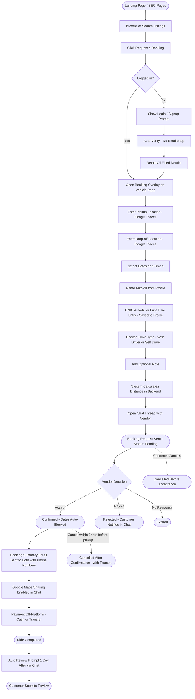
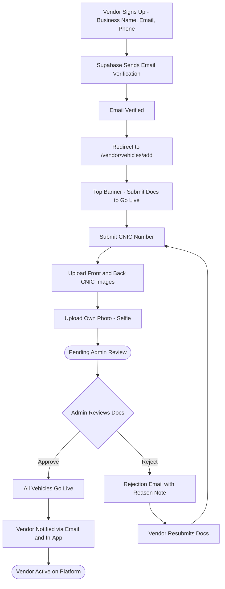
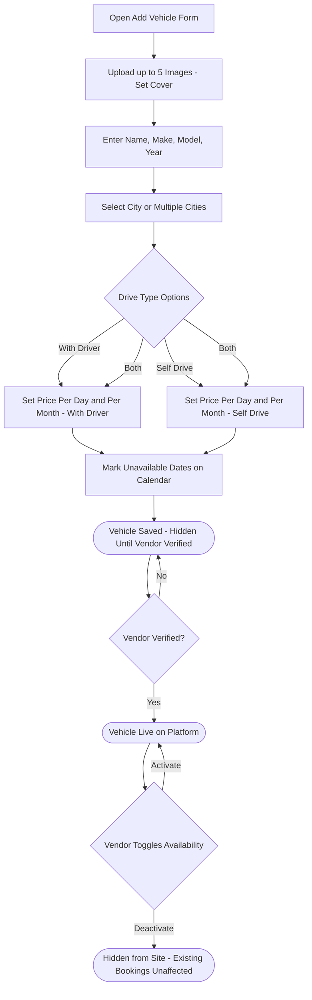
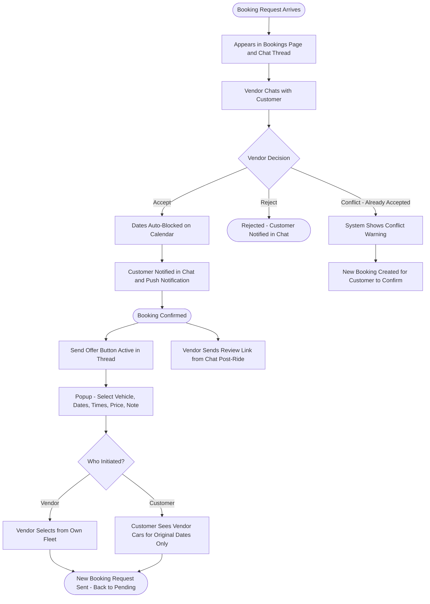
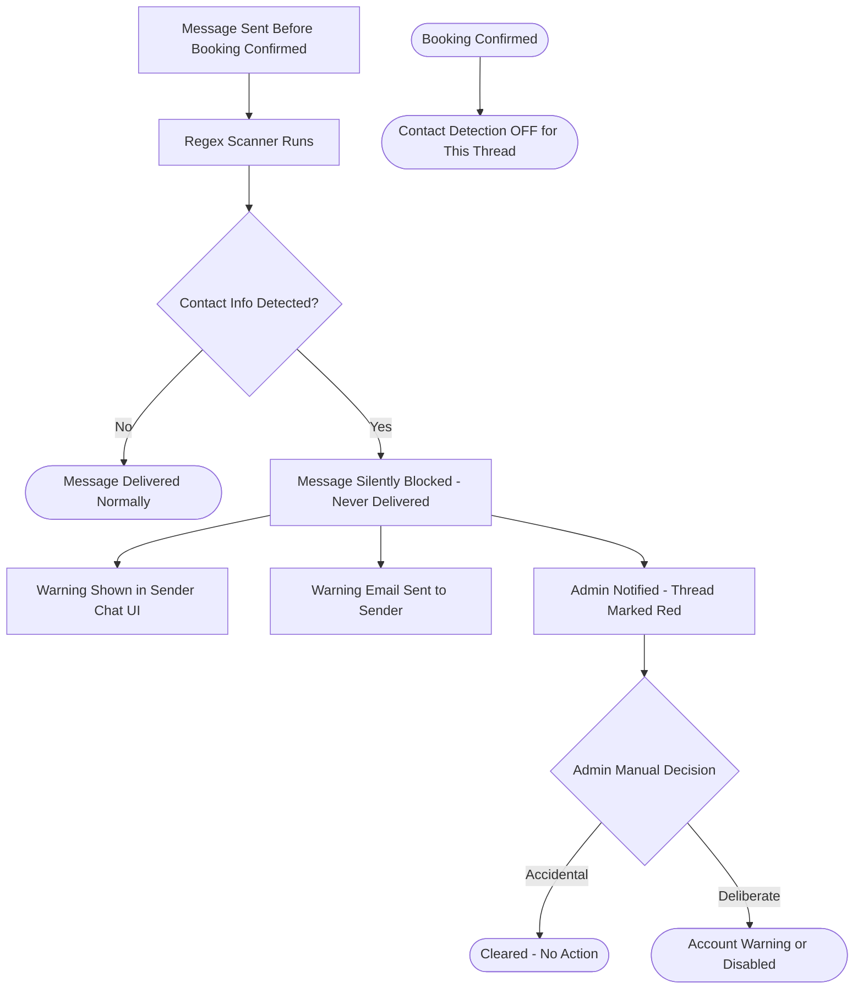
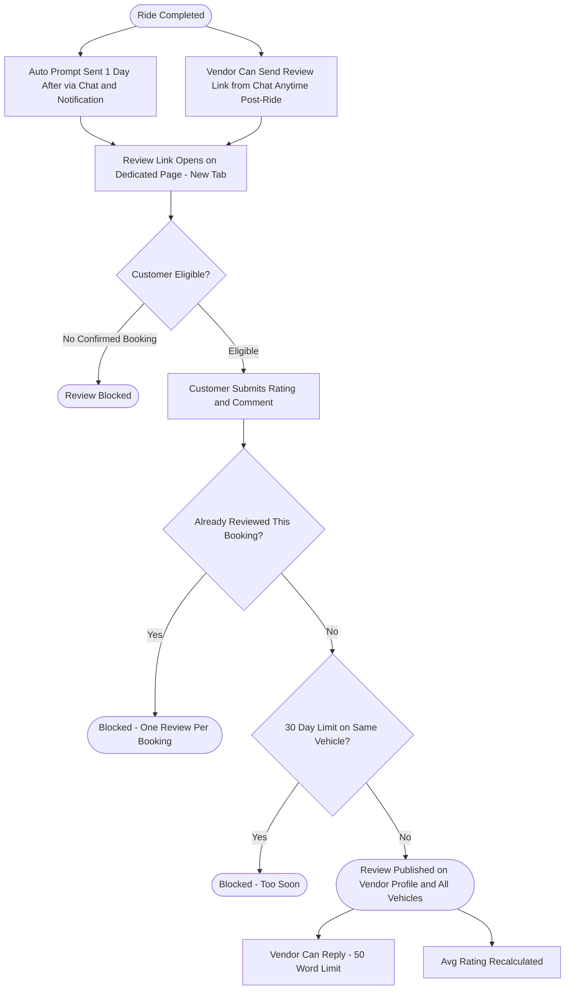
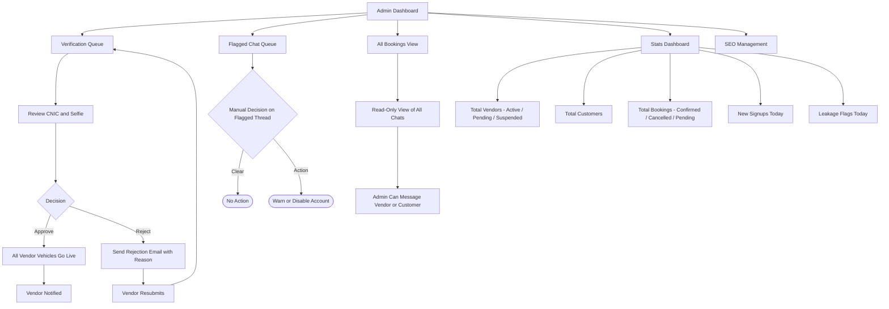
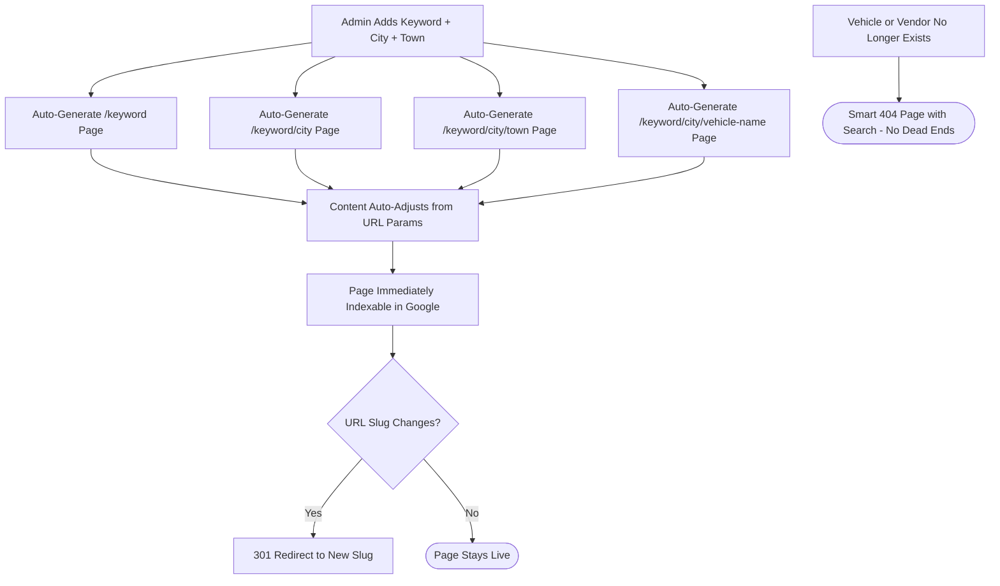
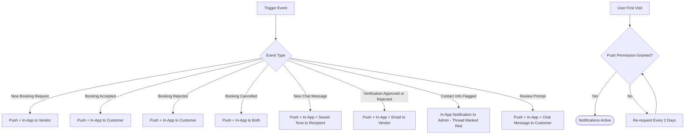

# RentNowPk — Mermaid Flowcharts

Paste each section into https://mermaid.live to preview.

---

## 1. Customer Journey

---

## 2. Vendor Onboarding and Verification

---

## 3. Vehicle Listing

---

## 4. Booking and Chat Flow

---

## 5. Contact Detection - Pre-Booking Only

---

## 6. Review System

---

## 7. Admin Panel

---

## 8. SEO Auto-Generation

---

## 9. Notification System

